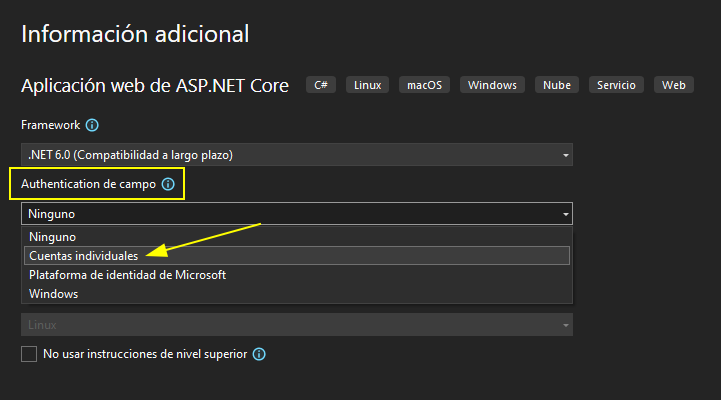
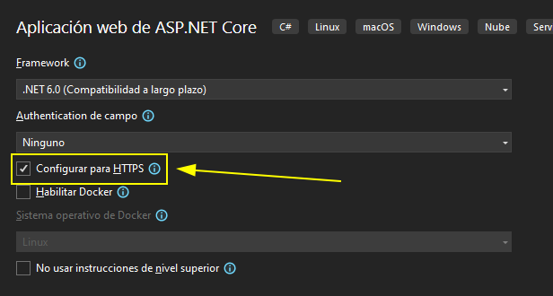
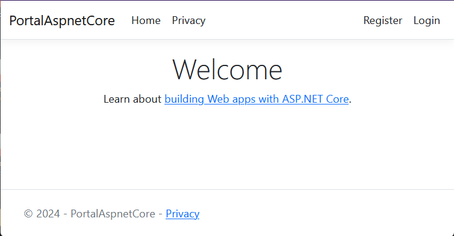
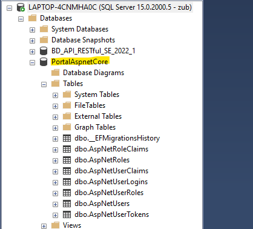

# 1. ASPNET CORE MVC PROJECT SETUP

## Create the project

First at all we need to install de dotnet CLI to create a new MVC project with the auth template.

```bash
dotnet new mvc --auth Individual -o proyecto
```

## Set HTTPS in development environment

```bash
dotnet dev-certs https --trust
```

## Visual Studio options

In case of use visual studio to create the aspnet core project, you can set up the same options:






## Run Project

To run the project

```bash
dotnet run
```


### GET ENTITY FRAMEWORK CORE TOOLS

> In case of use Visual Studio you need to use the Package manager console to install and apply the commands. It could be different than dotnet CLI Commands

[Microsoft. Install EF NET CORE project](https://learn.microsoft.com/en-us/ef/core/get-started/overview/install)

```bash
dotnet tool install --global dotnet-ef

dotnet tool install --global dotnet-ef --version 7.0.17
```

```bash
dotnet add package Microsoft.EntityFrameworkCore.Design
```

## SET the database

### SQLite

> As default the project has sqlite configuration, we need to set the correct connection string and apply the migrations to create the database

### SQL Server

To add EF Core to an application, install the NuGet package for the database provider you want to use.

In this case SQL SERVER:
```bash
dotnet add package Microsoft.EntityFrameworkCore.SqlServer

dotnet add package Microsoft.EntityFrameworkCore.SqlServer --version 7.0.17
```
As default, the project has SQLite configuration, we need to change it to SQL Server. Open `Program.cs`
Change line:
```csharp
builder.Services.AddDbContext<ApplicationDbContext>(options =>
    options.UseSqlite(connectionString));
    // change to
    options.UseSqlServer(connectionString));
```

Also we need to modify the migrations (Data/Migrations) code to avoid problem with sqlServer primary keys

**CreateIdentitySchema.cs**

```csharp
// Int primary keys should be use the sqlserver identity
Id = table.Column<int>(type: "int", nullable: false)
    .Annotation("SqlServer:Identity", "1, 1"),
```

```csharp
// String primary keys it should be setted to maxlength value
Id = table.Column<string>(nullable: false,maxLength: 128),
```

[**Code:** CreateIdentitySchema.cs](./docs/code/00000000000000_CreateIdentitySchema.cs)

Finally we need to setup the correct string connection sintax to stablished a connection with our SQL Server Database.

**appsettings.json:**

```json
{
  "ConnectionStrings": {
    "DefaultConnection": "Server=LAPTOP-4CNMHA0C;Database=PortalAspnetCore;User Id=zub;Password=root;MultipleActiveResultSets=true;Trusted_Connection=True;TrustServerCertificate=True;"
  },
}
```

### Apply migrations

> The database strategy used as default is the **code first** approach. This means that the database will be created or altered after we code it in our project with our migrations

The first time you apply the default migrations the database will be created and all tables will be added

```bash
dotnet ef database update
```
If we set up the correct string connection and correct code sintax in our migrations, it could be applied in our database server and the database will be created with all the necessary tables and relationships to have the default authentication and authorization behaviour

